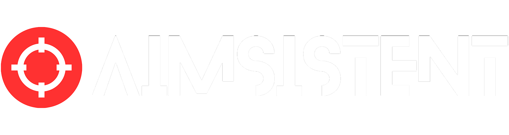

# AimSistent 🎯

**AimSistent** is a lightweight, browser-based aim trainer designed to help players warm up and improve their mouse accuracy and reaction time. Built entirely with vanilla HTML, CSS, and JavaScript.

## ✨ Features

- **Two Game Modes:**
  - **Dynamic:** Targets move and bounce off walls for tracking practice.
  - **Static:** Targets appear in random locations for flicking practice.
- **Flexible Timing:** Choose between **Standard (60s)** or **Quick Play (30s)**.
- **Combo & Multiplier System:**
  - Build combos to increase your score.
  - Every **5 consecutive hits** increases your score multiplier.
  - Misses reset your combo and multiplier immediately.
- **Customizable Settings:**
  - Change target colors.
  - Toggle "Break Animations" (particle effects on hit).
  - Enable **Keyboard Shooting** (Z / X keys) for osu! style play.
  - Select different hit sounds (Pop vs Knock).
- **Polished UI:** Full intro/outro video support, clean dark-mode interface, and confetti celebrations on task completion.

## 🕹️ How to Play

1. **Launch the Game:** Click `PLAY` on the title screen.
2. **Setup:** Review the tutorial and check your settings in the setup menu.
3. **Select Mode:** Choose between **Dynamic** or **Static**, and toggle your time limit.
4. **Start:** Click `START GAME`.
5. **Gameplay:**
   - **Click** (or press Z/X) on the targets before they disappear or move.
   - **Pause:** Press `ESC` at any time to pause the game, adjust settings, or restart.
